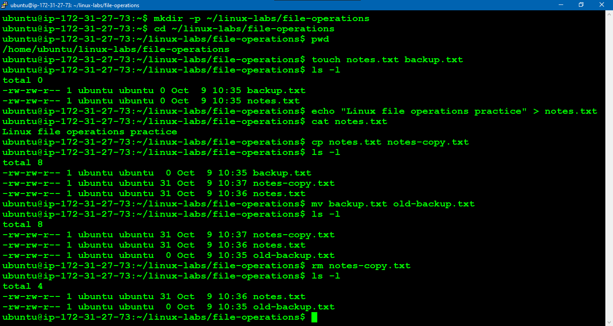

# Linux File Operations Lab

## Objective

Practice creating, listing, copying, renaming, and deleting files and directories.

## Environment

* Operating System: Ubuntu Linux
* Shell: Bash

## Tasks

### 1. Create a practice directory

```bash
mkdir -p ~/linux-labs/file-operations
cd ~/linux-labs/file-operations
```

### 2. Verify the current directory

```bash
pwd
```

Expected result: The path should end with `linux-labs/file-operations`.

### 3. Create sample files

```bash
touch notes.txt
touch backup.txt
ls -l
```

### 4. Write content to a file

```bash
echo "Linux file operations practice" > notes.txt
cat notes.txt
```

### 5. Copy a file

```bash
cp notes.txt notes-copy.txt
ls -l
```

### 6. Rename a file

```bash
mv backup.txt old-backup.txt
ls -l
```

### 7. Remove a file

```bash
rm notes-copy.txt
ls -l
```

### 8. Verify the final state

```bash
cat notes.txt
ls -la
```

## Validation

Record the actual output of the commands and verify that:

* `notes.txt` contains the expected text.
* `notes-copy.txt` no longer exists.
* `old-backup.txt` exists.

## Screenshots



## What I Learned

* Firstly, I checked in which path currently I am working using "pwd" command.
* I was learned through this journey how to create a single directory and multiple directories using "-p" command.
* Then I learned how move to another directories using "cd" command.
* And I created an empty file using "touch" command and add a content using "echo" command redirect into the file.
* I used "cp" & "mv" command to copy files and move or rename the file.
* Using "cat" command to view the content of the file in the terminal
* Using "rm" command removed the file 
* "ls -l" & "ls -la" is used to list the files in the directories. 

## Troubleshooting

* While creating a multiple directory, initially I was not used "-p" after I come to know it was used to create a parent & child directory.
* I missed to change working path before creating files. So, it was created in a home directory. Then I removed the file and change the directory then create a file in required directory.

